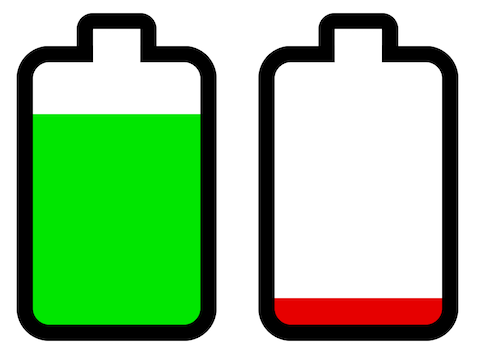

# BatteryView
Simple battery shaped UIView.

[![Swift Version][swift-image]][swift-url]
[![Build Status][travis-image]][travis-url]
[![License][license-image]][license-url]
[](https://img.shields.io/cocoapods/v/BatteryView.svg)  
[](http://cocoapods.org/pods/BatteryView)
[](http://makeapullrequest.com)

<p align="center">

</p>

## Usage

```swift
let batteryView = BatteryView(frame: smallRect)
batteryView.level = 42 // anywhere in 0...100
batteryView.lowThreshold = 25 // battery fill becomes red if level is below this threshold
batteryView.gradientThreshold = 50 // battery fill gradually changes from green to red below this threshold
```

## Changing Appearance

The properties below can be set in Interface Builder, in code, or through a UIAppearance proxy (e.g., `BatteryView.appearance().borderColor = .gray`).

**Colors:**

```swift
batteryView.borderColor    = .darkGray
batteryView.highLevelColor = .green
batteryView.lowLevelColor  = .red
batteryView.noLevelColor   = .gray
batteryView.noLevelText = "?" // shown over battery when the level is undefined or out of bounds
```

**Battery Shape:**

```swift
batteryView.direction = .minXEdge     // terminal facing left

batteryView.terminalLengthRatio = 0.1 // relative to battery length
batteryView.terminalWidthRatio = 0.4  // relative to battery width

batteryView.borderWidth = 2.5         // default is batteryLength / 20
batteryView.cornerRadius = 5          // default is batteryLength / 10
```

## Installation

### CocoaPods:

```ruby
pod 'BatteryView'
```

### Swift Package Manager:

```swift
dependencies: [
    .package(url: "https://github.com/yonat/BatteryView", from: "1.3.9")
]
```

## Meta

[@yonatsharon](https://twitter.com/yonatsharon)

[https://github.com/yonat/BatteryView](https://github.com/yonat/BatteryView)

[swift-image]:https://img.shields.io/badge/swift-4.2-orange.svg
[swift-url]: https://swift.org/
[license-image]: https://img.shields.io/badge/License-MIT-blue.svg
[license-url]: LICENSE.txt
[travis-image]: https://img.shields.io/travis/dbader/node-datadog-metrics/master.svg?style=flat-square
[travis-url]: https://travis-ci.org/dbader/node-datadog-metrics
